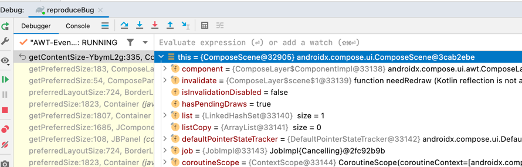

To reproduce exception:
 - Open in IDEA
 - Run reproduceBug in Debug mode  

 - wait some about 30 seconds
 - If IDEA will show dialog about fail to try evaluate breakpoint condition - say "No"
 - Exception will catched


## Exception stacktrace:
```
java.lang.IllegalStateException: ComposeScene is closed
	at androidx.compose.ui.ComposeScene.getContentSize-YbymL2g(ComposeScene.skiko.kt:335)
	at androidx.compose.ui.awt.ComposeLayer$ComponentImpl.getPreferredSize(ComposeLayer.desktop.kt:183)
	at androidx.compose.ui.awt.ComposePanel.getPreferredSize(ComposePanel.desktop.kt:54)
	at java.desktop/java.awt.BorderLayout.preferredLayoutSize(BorderLayout.java:724)
	at java.desktop/java.awt.Container.preferredSize(Container.java:1823)
	at java.desktop/java.awt.Container.getPreferredSize(Container.java:1807)
	at java.desktop/javax.swing.JComponent.getPreferredSize(JComponent.java:1685)
	at com.intellij.ui.components.JBPanel.getPreferredSize(JBPanel.java:108)
	at java.desktop/java.awt.BorderLayout.preferredLayoutSize(BorderLayout.java:724)
	at java.desktop/java.awt.Container.preferredSize(Container.java:1823)
	at java.desktop/java.awt.Container.getPreferredSize(Container.java:1807)
	at java.desktop/javax.swing.JComponent.getPreferredSize(JComponent.java:1685)
	at com.intellij.openapi.ui.Splitter.computeFirstComponentSize(Splitter.java:493)
	at com.intellij.openapi.ui.Splitter.doLayout(Splitter.java:428)
	at java.desktop/java.awt.Container.validateTree(Container.java:1722)
	at java.desktop/java.awt.Container.validateTree(Container.java:1731)
	at java.desktop/java.awt.Container.validateTree(Container.java:1731)
	at java.desktop/java.awt.Container.validateTree(Container.java:1731)
	at java.desktop/java.awt.Container.validateTree(Container.java:1731)
	at java.desktop/java.awt.Container.validate(Container.java:1657)
	at com.intellij.openapi.wm.impl.ToolWindowManagerImpl.registerToolWindow(ToolWindowManagerImpl.kt:1042)
	at com.jetbrains.rdserver.toolWindow.BackendServerToolWindowManager.registerToolWindow(BackendServerToolWindowManager.kt:87)
	at com.jetbrains.compose.LifecycleListener$1$invokeSuspend$$inlined$invokeLater$default$2.run(actions.kt:63)
	at com.intellij.openapi.application.TransactionGuardImpl.runWithWritingAllowed(TransactionGuardImpl.java:214)
	at com.intellij.openapi.application.TransactionGuardImpl.access$200(TransactionGuardImpl.java:21)
	at com.intellij.openapi.application.TransactionGuardImpl$2.run(TransactionGuardImpl.java:196)
	at com.intellij.openapi.application.impl.ApplicationImpl.runIntendedWriteActionOnCurrentThread(ApplicationImpl.java:805)
	at com.intellij.openapi.application.impl.ApplicationImpl.lambda$invokeLater$4(ApplicationImpl.java:348)
	at com.intellij.openapi.application.impl.FlushQueue.doRun(FlushQueue.java:82)
	at com.intellij.openapi.application.impl.FlushQueue.runNextEvent(FlushQueue.java:131)
	at com.intellij.openapi.application.impl.FlushQueue.flushNow(FlushQueue.java:47)
	at com.intellij.openapi.application.impl.FlushQueue$FlushNow.run(FlushQueue.java:187)
	at java.desktop/java.awt.event.InvocationEvent.dispatch(InvocationEvent.java:313)
	at java.desktop/java.awt.EventQueue.dispatchEventImpl(EventQueue.java:776)
	at java.desktop/java.awt.EventQueue$4.run(EventQueue.java:727)
	at java.desktop/java.awt.EventQueue$4.run(EventQueue.java:721)
	at java.base/java.security.AccessController.doPrivileged(Native Method)
	at java.base/java.security.ProtectionDomain$JavaSecurityAccessImpl.doIntersectionPrivilege(ProtectionDomain.java:85)
	at java.desktop/java.awt.EventQueue.dispatchEvent(EventQueue.java:746)
	at com.intellij.ide.IdeEventQueue.defaultDispatchEvent(IdeEventQueue.java:891)
	at com.intellij.ide.IdeEventQueue._dispatchEvent(IdeEventQueue.java:760)
	at com.intellij.ide.IdeEventQueue.lambda$dispatchEvent$6(IdeEventQueue.java:447)
	at com.intellij.openapi.progress.impl.CoreProgressManager.computePrioritized(CoreProgressManager.java:818)
	at com.intellij.ide.IdeEventQueue.lambda$dispatchEvent$7(IdeEventQueue.java:446)
	at com.intellij.openapi.application.impl.ApplicationImpl.runIntendedWriteActionOnCurrentThread(ApplicationImpl.java:805)
	at com.intellij.ide.IdeEventQueue.dispatchEvent(IdeEventQueue.java:492)
	at java.desktop/java.awt.EventDispatchThread.pumpOneEventForFilters(EventDispatchThread.java:203)
	at java.desktop/java.awt.EventDispatchThread.pumpEventsForFilter(EventDispatchThread.java:124)
	at java.desktop/java.awt.EventDispatchThread.pumpEventsForHierarchy(EventDispatchThread.java:113)
	at java.desktop/java.awt.EventDispatchThread.pumpEvents(EventDispatchThread.java:109)
	at java.desktop/java.awt.EventDispatchThread.pumpEvents(EventDispatchThread.java:101)
	at java.desktop/java.awt.EventDispatchThread.run(EventDispatchThread.java:90)
```